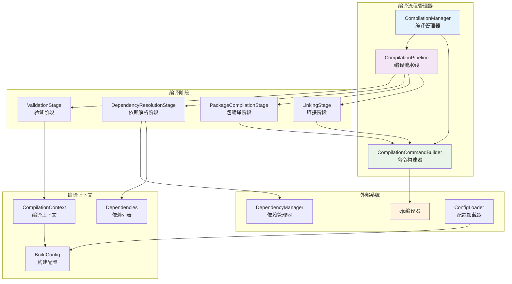
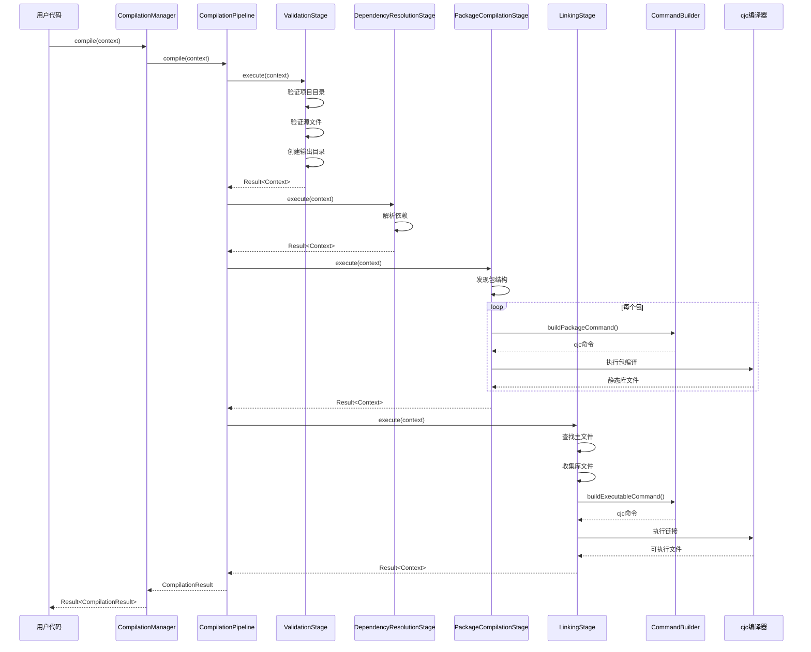
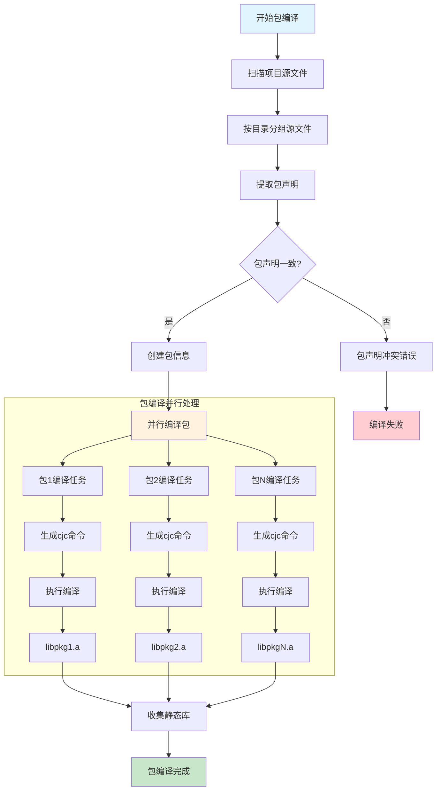
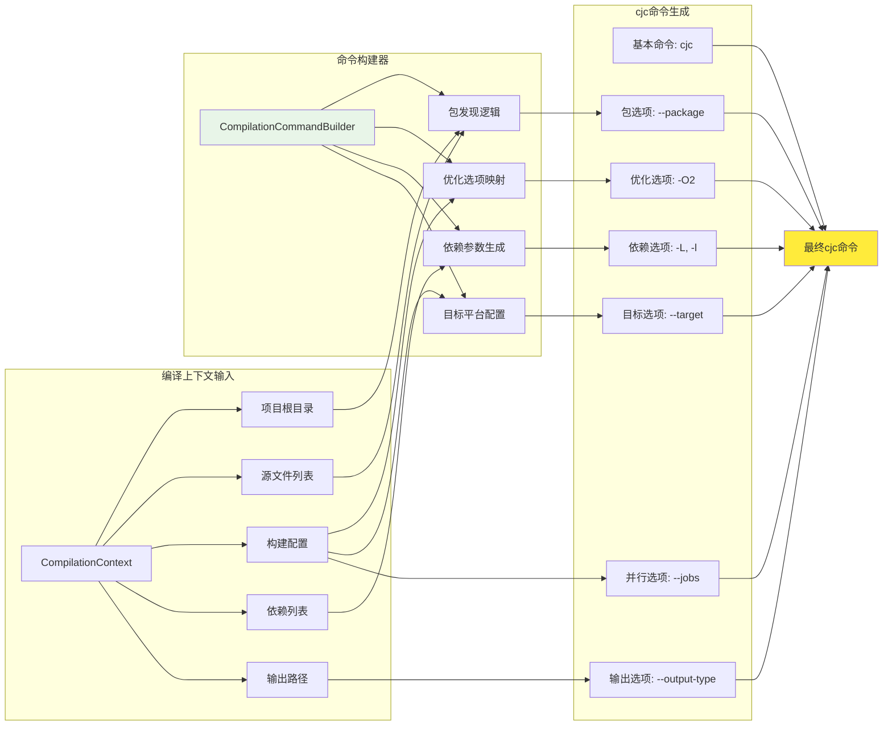
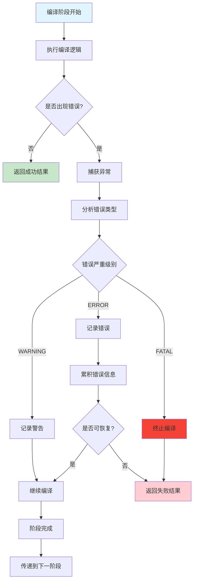
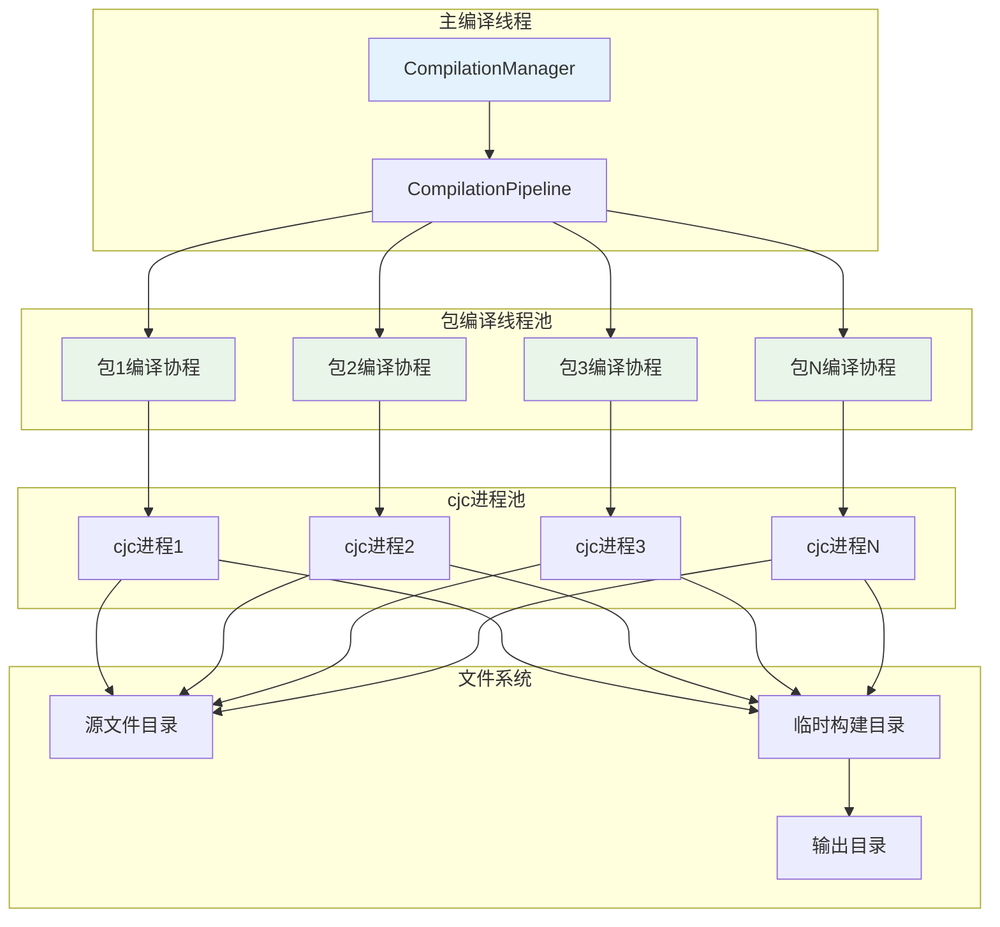
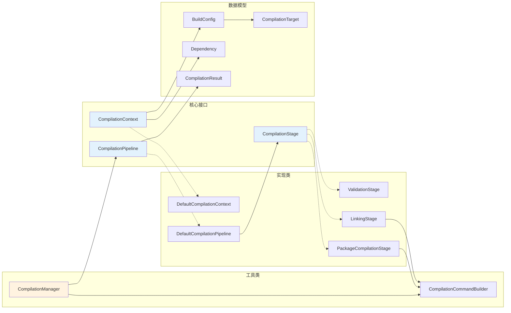

# 编译流程管理器架构图表

## 系统架构图

```mermaid
graph TB
    subgraph "编译流程管理器"
        CM[CompilationManager<br/>编译管理器]
        CP[CompilationPipeline<br/>编译流水线]
        CCB[CompilationCommandBuilder<br/>命令构建器]
    end
    
    subgraph "编译阶段"
        VS[ValidationStage<br/>验证阶段]
        DRS[DependencyResolutionStage<br/>依赖解析阶段]
        PCS[PackageCompilationStage<br/>包编译阶段]
        LS[LinkingStage<br/>链接阶段]
    end
    
    subgraph "编译上下文"
        CC[CompilationContext<br/>编译上下文]
        BC[BuildConfig<br/>构建配置]
        DEP[Dependencies<br/>依赖列表]
    end
    
    subgraph "外部系统"
        CJC[cjc编译器]
        DM[DependencyManager<br/>依赖管理器]
        CF[ConfigLoader<br/>配置加载器]
    end
    
    CM --> CP
    CM --> CCB
    CP --> VS
    CP --> DRS
    CP --> PCS
    CP --> LS
    
    VS --> CC
    DRS --> DM
    PCS --> CCB
    LS --> CCB
    
    CCB --> CJC
    DRS --> DEP
    CC --> BC
    CF --> BC
    
    style CM fill:#e3f2fd
    style CP fill:#f3e5f5
    style CCB fill:#e8f5e8
    style CJC fill:#fff3e0
```

## 编译流程时序图

```mermaid
sequenceDiagram
    participant User as 用户代码
    participant CM as CompilationManager
    participant CP as CompilationPipeline
    participant VS as ValidationStage
    participant DRS as DependencyResolutionStage
    participant PCS as PackageCompilationStage
    participant LS as LinkingStage
    participant CCB as CommandBuilder
    participant CJC as cjc编译器
    
    User->>CM: compile(context)
    CM->>CP: compile(context)
    
    CP->>VS: execute(context)
    VS->>VS: 验证项目目录
    VS->>VS: 验证源文件
    VS->>VS: 创建输出目录
    VS-->>CP: Result<Context>
    
    CP->>DRS: execute(context)
    DRS->>DRS: 解析依赖
    DRS-->>CP: Result<Context>
    
    CP->>PCS: execute(context)
    PCS->>PCS: 发现包结构
    
    loop 每个包
        PCS->>CCB: buildPackageCommand()
        CCB-->>PCS: cjc命令
        PCS->>CJC: 执行包编译
        CJC-->>PCS: 静态库文件
    end
    
    PCS-->>CP: Result<Context>
    
    CP->>LS: execute(context)
    LS->>LS: 查找主文件
    LS->>LS: 收集库文件
    LS->>CCB: buildExecutableCommand()
    CCB-->>LS: cjc命令
    LS->>CJC: 执行链接
    CJC-->>LS: 可执行文件
    LS-->>CP: Result<Context>
    
    CP-->>CM: CompilationResult
    CM-->>User: Result<CompilationResult>
```

## 包编译流程详图

```mermaid
graph TD
    A[开始包编译] --> B[扫描项目源文件]
    B --> C[按目录分组源文件]
    C --> D[提取包声明]
    
    D --> E{包声明一致?}
    E -->|否| F[包声明冲突错误]
    E -->|是| G[创建包信息]
    
    G --> H[并行编译包]
    
    subgraph "包编译并行处理"
        H --> I1[包1编译任务]
        H --> I2[包2编译任务]
        H --> I3[包N编译任务]
        
        I1 --> J1[生成cjc命令]
        I2 --> J2[生成cjc命令]
        I3 --> J3[生成cjc命令]
        
        J1 --> K1[执行编译]
        J2 --> K2[执行编译]
        J3 --> K3[执行编译]
        
        K1 --> L1[libpkg1.a]
        K2 --> L2[libpkg2.a]
        K3 --> L3[libpkgN.a]
    end
    
    L1 --> M[收集静态库]
    L2 --> M
    L3 --> M
    
    M --> N[包编译完成]
    F --> O[编译失败]
    
    style A fill:#e1f5fe
    style N fill:#c8e6c9
    style O fill:#ffcdd2
    style H fill:#fff3e0
```

## 命令构建流程图

```mermaid
graph LR
    subgraph "编译上下文输入"
        A[CompilationContext] --> B[项目根目录]
        A --> C[源文件列表]
        A --> D[构建配置]
        A --> E[依赖列表]
        A --> F[输出路径]
    end
    
    subgraph "命令构建器"
        G[CompilationCommandBuilder]
        
        G --> H[包发现逻辑]
        G --> I[优化选项映射]
        G --> J[依赖参数生成]
        G --> K[目标平台配置]
    end
    
    subgraph "cjc命令生成"
        L[基本命令: cjc]
        M[包选项: --package]
        N[输出选项: --output-type]
        O[优化选项: -O2]
        P[目标选项: --target]
        Q[并行选项: --jobs]
        R[依赖选项: -L, -l]
    end
    
    B --> H
    C --> H
    D --> I
    D --> K
    D --> Q
    E --> J
    F --> N
    
    H --> M
    I --> O
    J --> R
    K --> P
    
    L --> S[最终cjc命令]
    M --> S
    N --> S
    O --> S
    P --> S
    Q --> S
    R --> S
    
    style G fill:#e8f5e8
    style S fill:#ffeb3b
```

## 错误处理流程图

```mermaid
graph TD
    A[编译阶段开始] --> B[执行编译逻辑]
    B --> C{是否出现错误?}
    
    C -->|否| D[返回成功结果]
    C -->|是| E[捕获异常]
    
    E --> F[分析错误类型]
    F --> G{错误严重级别}
    
    G -->|WARNING| H[记录警告]
    G -->|ERROR| I[记录错误]
    G -->|FATAL| J[终止编译]
    
    H --> K[继续编译]
    I --> L[累积错误信息]
    J --> M[返回失败结果]
    
    K --> N[阶段完成]
    L --> O{是否可恢复?}
    
    O -->|是| K
    O -->|否| M
    
    N --> P[传递到下一阶段]
    
    style A fill:#e1f5fe
    style D fill:#c8e6c9
    style M fill:#ffcdd2
    style J fill:#f44336
```

## 并行编译架构图

```mermaid
graph TB
    subgraph "主编译线程"
        A[CompilationManager]
        B[CompilationPipeline]
    end
    
    subgraph "包编译线程池"
        C[包1编译协程]
        D[包2编译协程]
        E[包3编译协程]
        F[包N编译协程]
    end
    
    subgraph "cjc进程池"
        G1[cjc进程1]
        G2[cjc进程2]
        G3[cjc进程3]
        GN[cjc进程N]
    end
    
    subgraph "文件系统"
        H[源文件目录]
        I[临时构建目录]
        J[输出目录]
    end
    
    A --> B
    B --> C
    B --> D
    B --> E
    B --> F
    
    C --> G1
    D --> G2
    E --> G3
    F --> GN
    
    G1 --> H
    G2 --> H
    G3 --> H
    GN --> H
    
    G1 --> I
    G2 --> I
    G3 --> I
    GN --> I
    
    I --> J
    
    style A fill:#e3f2fd
    style C fill:#e8f5e8
    style D fill:#e8f5e8
    style E fill:#e8f5e8
    style F fill:#e8f5e8
```

## 依赖关系图

```mermaid
graph LR
    subgraph "核心接口"
        A[CompilationContext]
        B[CompilationPipeline]
        C[CompilationStage]
    end
    
    subgraph "实现类"
        D[DefaultCompilationContext]
        E[DefaultCompilationPipeline]
        F[ValidationStage]
        G[PackageCompilationStage]
        H[LinkingStage]
    end
    
    subgraph "工具类"
        I[CompilationCommandBuilder]
        J[CompilationManager]
    end
    
    subgraph "数据模型"
        K[BuildConfig]
        L[CompilationTarget]
        M[Dependency]
        N[CompilationResult]
    end
    
    A -.-> D
    B -.-> E
    C -.-> F
    C -.-> G
    C -.-> H
    
    E --> C
    J --> B
    J --> I
    G --> I
    H --> I
    
    A --> K
    A --> M
    K --> L
    B --> N
    
    style A fill:#e3f2fd
    style B fill:#e3f2fd
    style C fill:#e3f2fd
    style J fill:#fff3e0
```

这些图表全面展示了编译流程管理器的架构设计、执行流程和各组件间的关系，有助于理解系统的整体设计和实现细节。