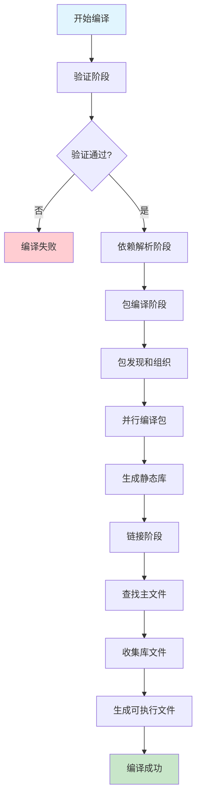

# 仓颉编译流程管理器

## 概述

编译流程管理器是 KCJPM 的核心组件，负责协调和管理整个仓颉项目的编译过程。它基于仓颉编译器（cjc）的特性设计，以**包（package）**为基本编译单位，实现了模块化、可扩展的编译流水线。

## 核心设计原则

1. **包级编译**：遵循仓颉编译器以包为基本单位的设计理念
2. **流水线架构**：采用可组合的编译阶段，支持自定义和扩展
3. **并行编译**：支持包级别的并行编译，提高编译效率
4. **错误处理**：完善的错误收集和报告机制
5. **跨平台支持**：支持多目标平台的交叉编译

## 架构组件

### 1. 编译上下文 (CompilationContext)

编译上下文封装了编译所需的所有信息：

```kotlin
interface CompilationContext {
    val projectRoot: Path           // 项目根目录
    val buildConfig: BuildConfig    // 构建配置
    val dependencies: List<Dependency>  // 依赖列表
    val sourceFiles: List<Path>     // 源文件列表
    val outputPath: Path           // 输出路径
    
    fun validate(): Result<Unit>
    fun toCompilerArgs(): List<String>
}
```

### 2. 构建配置 (BuildConfig)

构建配置定义了编译的各项参数：

```kotlin
data class BuildConfig(
    val target: CompilationTarget,              // 目标平台
    val optimizationLevel: OptimizationLevel,   // 优化级别
    val debugInfo: Boolean,                     // 调试信息
    val parallel: Boolean,                      // 并行编译
    val maxParallelSize: Int,                   // 最大并行数
    val incremental: Boolean,                   // 增量编译
    val verbose: Boolean                        // 详细输出
)
```

### 3. 编译流水线 (CompilationPipeline)

编译流水线定义了编译过程的各个阶段：

```kotlin
interface CompilationPipeline {
    val stages: List<CompilationStage>
    
    suspend fun compile(context: CompilationContext): Result<CompilationResult>
    fun addStage(stage: CompilationStage): CompilationPipeline
    fun insertStageAfter(afterStage: String, stage: CompilationStage): Result<CompilationPipeline>
    fun removeStage(stageName: String): CompilationPipeline
}
```

## 编译流程

### 流程图



### 详细阶段说明

#### 1. 验证阶段 (ValidationStage)

**职责**：检查编译环境和输入的有效性

**验证内容**：
- 项目根目录存在且可访问
- 源文件存在且为 `.cj` 文件
- 输出目录可创建
- 依赖配置合法

**失败处理**：收集所有验证错误，提供详细错误信息

#### 2. 依赖解析阶段 (DependencyResolutionStage)

**职责**：解析和准备项目依赖

**处理类型**：
- **路径依赖**：本地文件系统中的依赖项
- **Git 依赖**：从 Git 仓库获取的依赖
- **仓库依赖**：从远程包仓库获取的依赖

**输出**：已解析的依赖列表，包含本地路径信息

#### 3. 包编译阶段 (PackageCompilationStage)

**职责**：发现项目中的包并编译为静态库

**包发现流程**：


**编译过程**：
1. 分析源文件的包声明
2. 按包组织源文件
3. 为每个包创建独立的编译任务
4. 并行执行包编译
5. 生成静态库文件（`.a`）

**编译命令示例**：
```bash
cjc --package mypackage --module-name mypackage --output-type=staticlib -o libmypackage.a -O2
```

#### 4. 链接阶段 (LinkingStage)

**职责**：将编译后的包链接为最终可执行文件

**链接过程**：
1. 查找包含 `main` 函数的主文件
2. 收集所有编译生成的静态库
3. 收集依赖的外部库文件
4. 执行最终链接

**链接命令示例**：
```bash
cjc main.cj libpackage1.a libpackage2.a -l external_lib -o myapp.exe
```

## 命令构建器 (CompilationCommandBuilder)

命令构建器负责将编译配置转换为 cjc 编译器的命令行参数。

### 核心功能

#### 1. 基本编译命令构建

```kotlin
fun buildCommand(context: CompilationContext): List<String>
```

根据编译上下文生成完整的 cjc 命令，包括：
- 包编译选项（`--package`）
- 输出类型（`--output-type`）
- 优化级别（`-O0`, `-O2`, `-Os`, `-O3`）
- 目标平台（`--target`）
- 并行编译（`--jobs`）
- 调试信息（`-g`）

#### 2. 包编译命令

```kotlin
fun buildPackageCommand(
    packageDir: Path,
    outputPath: Path,
    buildConfig: BuildConfig,
    moduleName: String?
): List<String>
```

专门用于编译单个包为静态库。

#### 3. 可执行文件链接命令

```kotlin
fun buildExecutableCommand(
    mainFile: Path,
    libraryFiles: List<Path>,
    outputPath: Path,
    buildConfig: BuildConfig
): List<String>
```

用于链接多个静态库生成最终可执行文件。

### 编译选项映射

| 配置项 | cjc 参数 | 说明 |
|--------|----------|------|
| OptimizationLevel.DEBUG | `-O0` | 调试模式，无优化 |
| OptimizationLevel.RELEASE | `-O2` | 发布模式，平衡优化 |
| OptimizationLevel.SIZE | `-Os` | 优化二进制体积 |
| OptimizationLevel.SPEED | `-O3` | 优化执行速度 |
| debugInfo = true | `-g` | 生成调试信息 |
| parallel = true | `--jobs N` | 并行编译 |
| incremental = true | `--experimental --incremental-compile` | 增量编译 |
| verbose = true | `--verbose` | 详细输出 |

## 使用示例

### 基本使用

```kotlin
val compilationManager = CompilationManager()

val context = DefaultCompilationContext.builder()
    .projectRoot(projectPath)
    .buildConfig(BuildConfig(CompilationTarget.LINUX_X64))
    .addSourceFile(sourceFile)
    .outputPath(outputPath)
    .build()

val result = compilationManager.compile(context)
when (result.getOrNull()) {
    is CompilationResult.Success -> println("编译成功")
    is CompilationResult.Failure -> println("编译失败")
}
```

### 自定义编译流水线

```kotlin
val customPipeline = DefaultCompilationPipeline()
    .addStage(CustomOptimizationStage())
    .insertStageAfter("validation", PreprocessingStage())

val manager = CompilationManager().withCustomPipeline(customPipeline.stages)
```

### 仅编译包

```kotlin
val libraryPaths = compilationManager.compilePackagesOnly(context)
// 生成的静态库可用于其他项目
```

## 错误处理

### 编译错误类型

```kotlin
data class CompilationError(
    val message: String,
    val file: String? = null,
    val line: Int? = null,
    val column: Int? = null,
    val severity: Severity = Severity.ERROR
)
```

### 错误严重级别

- **WARNING**：警告，不影响编译
- **ERROR**：错误，编译失败
- **FATAL**：致命错误，终止编译流程

## 性能优化

### 并行编译

1. **包级并行**：不同包可以并行编译
2. **内部并行**：单个包内部使用 `--jobs` 参数并行编译
3. **依赖感知**：考虑包间依赖关系的编译顺序

### 增量编译

1. **文件级增量**：只重新编译修改过的文件
2. **包级增量**：只重新编译依赖变化的包
3. **缓存机制**：缓存编译中间结果

## 扩展性

### 自定义编译阶段

```kotlin
class CustomStage : CompilationStage {
    override val name = "custom-optimization"
    
    override suspend fun execute(context: CompilationContext): Result<CompilationContext> {
        // 自定义逻辑
        return Result.success(context)
    }
}
```

### 插件机制

编译流水线支持动态添加、插入和移除编译阶段，为构建工具和IDE集成提供了灵活的扩展能力。

## 与现有系统集成

编译流程管理器与 KCJPM 的其他组件紧密集成：

- **依赖管理器**：提供依赖解析服务
- **配置系统**：读取 `cjpm.toml` 中的构建配置
- **项目管理器**：协调多模块项目的编译

这种设计确保了编译流程的一致性和可维护性。